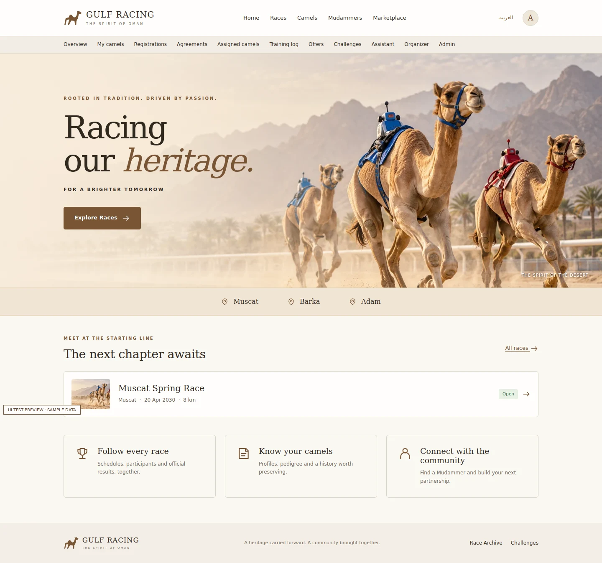
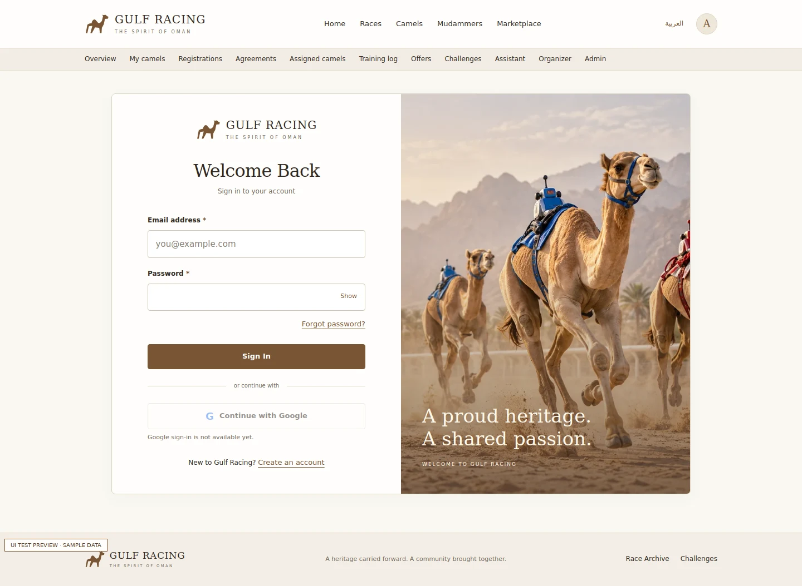
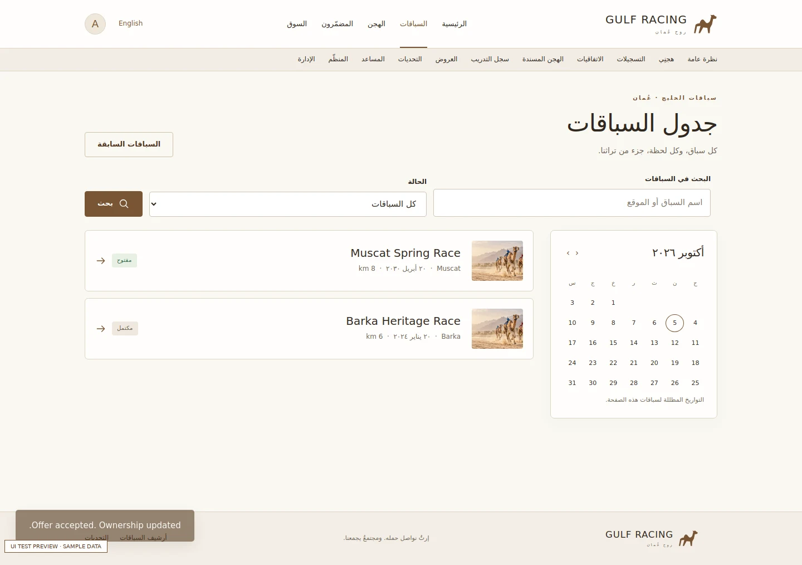

# Gulf Racing frontend

A desktop-first HTML, CSS and JavaScript interface based on the supplied Gulf Racing reference: warm sand backgrounds, brown actions, classic serif headings, camel photography, quiet borders and compact navigation. It also adapts to smaller screens and supports English/Arabic with RTL layout.

There is no application framework, bundler, component dependency or runtime CDN. Browser-native ES modules separate the API client, router, shared UI and feature views. Node is used only for the local static server and development checks. Run `npm run format` to keep source formatting consistent. The browser calls the existing Spring Boot backend.

## Run locally

1. Start the backend on port 8080 using [the backend instructions](../backend/README.md).
2. With Node.js 20 or later, run:

   ```bash
   cd frontend
   npm start
   ```

3. Open **http://localhost:5500/**. Use the same hostname for both frontend and backend. `127.0.0.1` on both also works.
4. Register an account and sign in. New accounts receive `VIEWER`; an existing administrator must assign OWNER, TRAINER or ORGANIZER for those workspaces. There are no seeded users or passwords in this frontend.

`npm start` needs no installed dependencies. For Python users, `python -m http.server 5500 --directory frontend` from the repository root also serves the static app. Do not open `index.html` directly with `file://`, because ES modules and credentialed requests need HTTP.

`js/config.js` defaults to port 8080 on the current local hostname. For another environment, set `apiBase` to the backend's exact public origin and configure the backend `FRONTEND_ORIGINS` to the frontend's exact origin. Use HTTPS and secure session cookies in production. The included Node server is a local development server; deploy only `index.html`, `reset-password.html`, `assets/` and `js/` through your production static host or reverse proxy. Hash routes work without server-side rewrite rules.

### Optional services

- **Google:** configure the backend `google` profile and OAuth client, set `OAUTH_SUCCESS_URL=http://localhost:5500/#/home`, then set `googleEnabled: true` in `js/config.js`. Until configured, the Google control explains that sign-in is unavailable.
- **Reset emails:** configure backend SMTP and set `PASSWORD_RESET_URL=http://localhost:5500/reset-password.html`. The page consumes `#token=...`, removes it from the address bar before requests, and holds it in memory until submission. Refreshing the page requires reopening the emailed link.
- **Assistant:** configure the backend AI profile/provider. The UI checks `/api/ai/status` and shows an unavailable state when the service is disabled. No provider keys belong in frontend code.

## Reference screen coverage

| Reference | UI route (after `#`) | Connected behavior |
| --- | --- | --- |
| 01 Entry | `/` | Heritage hero; open races and navigation |
| 02 Sign in | `/signin` | Session login; conditional Google OAuth |
| 03 Create account | `/signup` | Registration; confirmation and password validation |
| 04 Forgot password | `/forgot-password`, `/reset-password` | Email recovery and fragment-token reset |
| 05 Home | `/home` | Profile welcome; workspaces appropriate to the account |
| 06 Schedule | `/races` | Search, status filter, pagination and calendar |
| 07 Race detail | `/races/:id` | Actual race data and registration navigation |
| 08 Participants | `/races/:id/participants` | Latest published race card |
| 09 Ownership | `/camels/:id/ownership` | Public chronological ownership records |
| 10 Camel profile | `/camels/:id` | Profile, registered parents, owners and listing |
| 11 Results | `/races/:id/results` | Official results image and printing |
| 12 Archive | `/archive` | Completed races with search and pagination |
| 13 Settings | `/settings` | Name, profile image URL, language and sign out |
| 14 Agreement | `/agreements/new` | Camel/trainer selection, fees, shares and dates |
| 15 Add camel | `/camels/new`, `/camels/:id/edit` | Create/update owned camel data |
| 16 Mudammers | `/trainers` | Trainer profiles and agreement selection |
| 17 Partnerships | `/agreements` | Status tabs; accept, reject and terminate |
| 18 Assigned camels | `/assigned` | Active agreements for the signed-in trainer |
| 19 Training | `/training?agreement=:id` | Read sessions; assigned trainer appends logs |
| 20 Marketplace | `/marketplace`, `/marketplace/:id` | Search, price filters, listings and offers |
| 21 Accept offer | `/offers/:id` | Seller reviews and confirms ownership transfer |
| 22 Organizer | `/organizer`, `/organizer/races/:id` | Race edits, entry decisions, results and race-card publication |
| 23 Admin | `/admin` | User pagination, roles and account status |
| 24 Assistant | `/assistant` | Availability check; questions, answers and source labels |
| 25 Voting | `/challenges`, `/challenges/:id` | Voting windows, vote counts, percentages and submission |

Supporting routes: `/camels`, `/my-camels`, `/registrations`, `/my-listings`, `/marketplace/new`, `/marketplace/:id/edit`, `/offers`, `/trainer-profile`, `/organizer/races/new`.

## API alignment and current limits

The Java controllers/DTOs at base commit `d5ddf83c30549b59d18ecb8243231a48393c668e` are the source of truth. Some text in `docs/API.md` predates those controllers.

- Training records use `durationMinutes`, **not** the distance field illustrated in the concept image.
- `/api/agreements/assigned` is documented but is absent from the current controller. The assigned view reads `/api/agreements/mine` and selects ACTIVE agreements for the current trainer. Training writes also check the effective dates in the UI, and the server enforces authorization.
- Trainer responses contain `userId`, `bio`, and `location`, without a public name or photograph. Cards display the real trainer ID and available details. No names or avatars are fabricated.
- Direct file upload is not exposed by this backend. Camel photos, avatars and official result images use validated HTTP(S) URLs; absent images get an explicit placeholder.
- Public participants come from published race cards. Private registration endpoints are reserved for their authorized viewers. A missing published card is an empty state, not a fake participant list.
- New administrators cannot directly create users through an admin endpoint because none exists. Users register normally; administrators then assign roles and status. The UI does not offer unsupported notification/privacy switches.
- Sale acceptance changes ownership through the existing service. The UI confirms the amount and transfer; it does not claim to process payments.
- Agreements remain in this frontend because they exist in the supplied interface reference and the current controllers. No backend entity, migration or business rule was changed.
- The calendar highlights races in the current page of results; its month controls do not claim to perform a server-side date filter.
- UI navigation guards improve usability. Backend authorization remains the security boundary.

## Implementation conventions

- `js/api.js`: credentialed requests; CSRF fetched before writes and refreshed after login/logout; normalized errors; timeouts; navigation cancellation. Failed mutations are never automatically replayed.
- `js/router.js` and `js/app.js`: hash routes, role guards, focus management and event delegation; stale route requests cannot overwrite the current page.
- `js/ui.js`: escaped text, restricted image URLs, uniquely labelled form inputs, inline validation errors, reusable tables/cards and pagination.
- `js/views/`: auth, races, camels, training, marketplace, account, management and community views.
- `assets/styles.css`: shared color/spacing tokens, logical properties for RTL, visible keyboard focus, reduced-motion support and print styles.
- Passwords, sessions and CSRF tokens are never stored in localStorage. Only the browser language preference is persisted. Assistant conversation text is temporary and rendered as text.
- Form submission prevents duplicates and reports failures; account actions and ownership transfer require an explicit UI confirmation. Photo URLs are external requests and use `referrerpolicy="no-referrer"`.

## Verification

```bash
npm ci
npm run check
npm test
npx playwright install chromium
npm run test:browser
```

The browser suite renders 41 routes, checks duplicate IDs and horizontal overflow, and exercises session login/logout, reset token removal, password validation, CSRF rotation, role guards, camel/agreement/training writes, offer acceptance, voting, assistant responses, persisted Arabic/RTL, mobile layouts and service failures. It uses deterministic intercepted API fixtures in `tests/fixtures.mjs`; fixtures are never imported by application code. This verifies browser behavior and the reviewed request contracts, not a live deployment or the user's database. Backend integration tests remain in the backend CI jobs.

Screenshots in `test-results/` are labelled **UI TEST PREVIEW · SAMPLE DATA**. CI uploads them as artifacts. Selected screenshots are in `docs/screenshots/`. An existing Chromium can be used via `PLAYWRIGHT_CHROMIUM_EXECUTABLE=/absolute/path/to/chromium` when the standard browser download is unavailable.

## Image asset

`assets/racing-hero.webp` is an original generated decorative image (about 159 KiB), reused on marketing/auth/race header surfaces. It is not presented as the actual photo of a specific camel. Record cards use their own `photoUrl` or a clearly labelled missing-photo state.

Generated with the built-in ImageGen tool, then encoded as WebP for delivery. Prompt: “A wide realistic editorial photograph of three single-humped racing camels running on a pale Omani sand track with small robotic jockeys in understated blue and red tack; no human riders. Camels on the right two-thirds, open pale sand and dusty sky on the left for a headline. Hazy Hajar mountains and distant palms, soft golden morning light, cream/beige/caramel/warm brown palette, natural photography, sharp detail, subtle kicked-up sand. No text, watermark, logo or UI.”

## Visual review

These screenshots contain labelled test fixtures, not production records.






